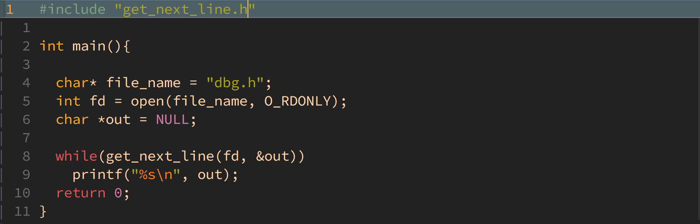

# get_next_line

## Description

The main purpose of this project is to code a function that returns a line ending with a newline, read from a file descriptor.

What you should learn from this project:

- Write well-structured and good extensible code.
- You will mainly learn a highly interesting concept in C programming: static variables.
- Unix logic
- Rigor

---

## Prototype

`int get_next_line(int fd, char **line);`

## Usage

### Parameters

- `#1. file descriptor for reading`
- `#2. The value of what has been read`

### Return value

- `1 : A line has been read.`
- `0 : EOF has been reached.`
- `-1 : An error happened.`

## How To Set Up

- `git clone https://github.com/MoBoustta/get_next_line.git`
- `cd get_next_line`
- `create a .c for example main.c`
- `add a main() and include ft_get_next_line.h header to main.c`
- `call get_next_line() inside the main()`
- `gcc -Wall -Wextra -Werror -D BUFFER_SIZE=32 get_next_line.c get_next_line_utils.c main.c`
  

## NOTES

- Calling get_next_line in a loop will then allow you to read the text available on a file descriptor one line at a time until the EOF.
- The BUFFER_SIZE defined during compilation is used by 'built_in read function' to read from a file or from stdin.

## Author

- **moboustt** - [moboustta6@gmail.com](https://github.com/MoBoustta)
